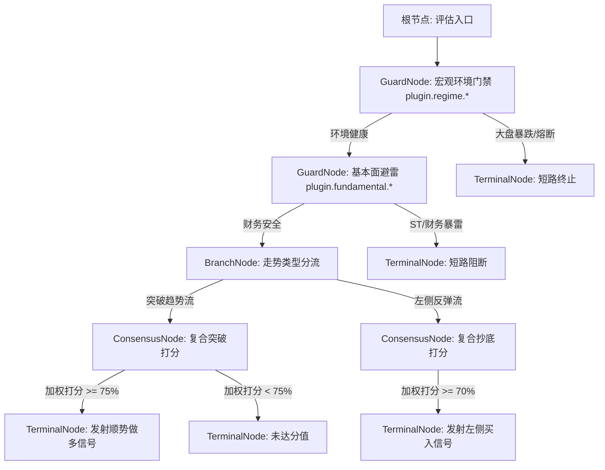

# Design: 因子插件体系与决策流树（Factor Plugin & Decision Flow）

## 1. 架构总览与设计哲学

本设计致力于将 Mist 的策略信号生成引擎打造为一个**通用、中立、领域无关的工业级多因子决策树平台（Domain-Agnostic Decision Platform）**，并对现有系统中已出现的技术面硬编码分叉进行全面收敛与合并。

### 核心设计哲学

1. **核心内核极致中立（Strict Domain Neutrality）**：
   - 核心决策引擎（`DecisionFlowEngine`）不绑定任何特定的交易理论或流派；
   - **技术面（经典指标/量价/形态/波浪）、缠论几何、基本面财务、主力资金/L2、宏观环境、事件驱动及外置 AI 模型在系统内享有完全对等的公民地位**；
   - **缠论（ChanCore）仅作为技术形态门类下的一个普通插件套件（Plugin Suite）**，核心引擎内部禁止任何缠论专有字段或特权逻辑的硬编码。
2. **插件内生闭环与自治（Autonomous Plugins）**：
   - 插件对自己内部算法和逻辑闭环负责；
   - 插件不把生命周期负担甩给全局调度器。每次被调用时，插件根据当前时点的事实做出独立的观点表态（`BUY` / `SELL` / `NEUTRAL`）；
   - “策略是否装配该插件”即是该插件在该策略下的生命周期。
3. **树状控制流解耦（Decision Flow Routing）**：
   - 真实的交易逻辑不是扁平打分，而是条件分流与因果级联；
   - 将插件作为决策树上的执行节点，天然实现：大盘定调分流、轻量门禁短路、特征逐级富化、局部共识打分与最终决策发射。
4. **全链路白盒归因（Explainable Execution Trace）**：
   - 每一个生成的信号都完整携带从根节点到叶子节点的决策路径轨迹；
   - 明确展现“为什么触发”、“谁投了赞同票”、“谁投了否决票”、“未触发时阻断在哪个节点”。

---

## 2. 开源业界架构借鉴与范式沉淀

在开源量化社区与工业界中，策略编排与因子系统演进形成了四大主流范式：

| 范式 / 开源系统 | 核心设计 | 优缺点分析 | 对 Mist 的借鉴与取舍 |
| :--- | :--- | :--- | :--- |
| **QuantConnect LEAN**<br/>(算法框架三段论) | Alpha 模型与 Portfolio 彻底解耦。Alpha 插件仅输出 `Insight` 对象（Symbol, Direction, Confidence, Period），不触碰订单与持仓。 | **优点**：极度纯粹、插件可插拔性极强。<br/>**局限**：LEAN 侧重扁平并行收集，缺乏层级分支控制。 | **全面吸收**其 `Insight` 输出契约：因子插件只输出纯粹观点与置信度，不关心撮合。 |
| **游戏/机器人 AI**<br/>(行为树 Behavior Tree) | 采用 `Sequence`（顺序短路）、`Selector`（回退路由）、`Condition`（门禁）树状拓扑编排逻辑。 | **优点**：结构清晰、天然支持 Fast-Fail 短路、极易可视化。<br/>**局限**：原生行为树侧重状态切换而非数值评分。 | **全面吸收**其树状控制流，将门禁、分支、打分映射为树节点。 |
| **WorldQuant / DolphinDB**<br/>(表达式 DAG 流水线) | 将万级因子解析为有向无环图（DAG），利用 AST 自动优化计算依赖与时序对齐。 | **优点**：特征复用率极高、数学表达优雅。<br/>**局限**：系统极重，拓扑排序复杂，不适宜条件分支决策。 | **吸收其特征复用机制**，通过轻量“黑板模式（BlackBoard）”解决特征传递，不引入重型 DAG 引擎。 |
| **Microsoft Qlib**<br/>(AI特征与打分模型) | Feature Store $\rightarrow$ Model Score $\rightarrow$ TopK Strategy 三层分离。 | **优点**：横截面批量打分能力强。<br/>**局限**：偏向离线批量预测，缺乏实时盘中因果流编排。 | 借鉴其打分（Score）与阈值门控思想。 |

---

## 3. 核心权衡：我们需要做通用 DAG 吗？

在量化系统设计中，“要不要做有向无环图（DAG）”是一个经典的分水岭问题。

### 3.1 结论先行：坚决不做重型通用 DAG，采用“控制流决策树 + 数据流黑板模式 (Tree + BlackBoard)”

**业务本质决定架构**：
- **数据转换处理（ETL/特征计算）**是“网（DAG）”；
- 但**交易战略决策（Trading Decision）**天然是“树（Tree）”——从宏观大盘分流，经过行业与标的门禁，分化到具体的形态触发，最后叶子节点裁决。

### 3.2 深度对比：通用 DAG vs 决策树 + 黑板模式

| 比较维度 | 通用 DAG 方案（如 Airflow/DolphinDB 引擎） | 决策树 + 共享黑板模式（本设计推荐） |
| :--- | :--- | :--- |
| **控制流拓扑** | 复杂网状结构，任意节点间有依赖边 | **严格树状结构**（根 $\rightarrow$ 门禁 $\rightarrow$ 分支 $\rightarrow$ 叶子） |
| **跨节点数据共享** | 声明式 Output-to-Input 连线传递 | **轻量黑板模式 (`context.attributes`)**：上游存入，下游按需读取 |
| **短路剪枝 (Fast-Fail)**| 极难短路，下游依赖未满足时会挂起或产生复杂级联取消 | **天然毫秒级短路**：门禁失败直接子树 Abort，零多余运算 |
| **死锁与环风险** | 必须在运行时进行拓扑排序与成环检测（Cycle Detection） | **天然无环**（纯树状递归遍历） |
| **前端交互与维护性** | 蜘蛛网式连线画布（Spaghetti Graph），用户极易配错 | **折叠式决策树 / 积木块拖拽**，直观易懂，可读性极高 |
| **全链路归因解释** | 很难向交易员解释网状图的触发逻辑 | **一条清晰路径**：从根到叶的命中链条直接呈现 |

因此，我们采用 **“树状控制流 + 黑板数据流”**：
- **控制流是树**：保证了执行逻辑的单向性、条件分支的确定性与短路剪枝的高性能；
- **数据流是黑板**：前置节点（如某指标/形态提取器）算出的派生特征直接存入上下文属性字典（黑板），后置节点自由读取，**100% 解决了特征共享问题，同时避开了通用 DAG 的巨大工程复杂度**。

---

## 4. 全景因子插件体系契约（Factor Plugin Specification）

### 4.1 通用因子分类体系 (Domain-Agnostic Taxonomy)

平台原生定义 7 大通用插件插槽，任何量化研究员均可自由扩展：

| 插槽代码 | 领域分类 | 涵盖范畴与数据源 | 典型插件生态举例 |
| :--- | :--- | :--- | :--- |
| `REGIME` | 宏观与大盘环境 | 宽基指数趋势、行业轮动、市场情绪温度计 | 大盘20日线风控、沪深300多空状态 |
| `FUNDAMENTAL` | 基本面与财务质量 | 季报/年报财报、估值分位、ROE、成长性 | 连续3年ROE>15%避雷门禁、净利润断层爆发 |
| `CAPITAL` | 资金面与微观流动性 | L2逐笔主力、北向外资、龙虎榜席位、融资融券 | 北向资金连续3日净加仓、游资龙虎榜跟庄 |
| `EVENT` | 事件驱动与公告 | 业绩预喜预增、高管增减持、大额中标、解禁 | 业绩超预期预增、重大解禁期硬风控避雷 |
| `TECHNICAL` | 经典量价与技术指标 | 均线系统、突破、MACD/KDJ、ATR波动率、量比 | 突破5日均量2倍、布林带通道突破 |
| `CHAN` | 缠论几何形态(独立套件) | 笔、段、中枢、背驰、一/二/三类买卖点 | 缠论一买底背驰确立、三买回抽不破中枢 |
| `AI_SENTIMENT`| 外部 AI 与另类舆情 | 研报一致预期、新闻情感NLP、Python ML模型 | LLM研报多空倾向打分、LightGBM时序预测 |

### 4.2 核心接口定义

```typescript
export type FactorAction = 'BUY' | 'SELL' | 'NEUTRAL';

export interface FactorOpinion {
  /** 插件观点：做多、做空、或弃权/中立 */
  action: FactorAction;
  /** 插件对自己当前判断的置信度 (0.0 ~ 1.0) */
  confidence: number;
  /** 简明人类可读原因，用于归因解释 */
  reason: string;
  /** 结构化快照特征数据，用于事后回溯与终端绘图 */
  evidence?: Record<string, unknown>;
}

export interface FactorContext {
  securityId: number;
  securityCode: string;
  timestamp: Date;
  /**
   * 共享黑板（BlackBoard）：
   * 前置节点向其中写入派生特征（如 chan.central: {zd, zg} 或 l2.net_inflow），后置节点按需直接读取，无需重复计算。
   */
  attributes: Map<string, unknown>;
  /** 标的行情数据接口 */
  marketData: StrategyMarketDataPort;
  /** 外部特征代理接口（按需注入） */
  features?: Record<string, unknown>;
}

export interface FactorPlugin {
  readonly id: string;
  readonly name: string;
  readonly category: string;
  readonly description: string;

  /**
   * 插件求值接口：无状态异步纯函数
   */
  evaluate(context: FactorContext, params?: Record<string, unknown>): Promise<FactorOpinion>;
}
```

---

## 5. 决策流树（Decision Flow Tree）结构设计

决策流引擎负责按树状拓扑自顶向下递归求值：



### 5.1 五种核心节点模型

1. **门禁节点 (`GuardNode`)**：
   - 用于快速失败（Fast-Fail）和短路。例如：大盘环境是否安全？标的是否属于ST或业绩暴雷股？
   - 不符合条件立即剪枝退出。
2. **条件分支节点 (`BranchNode`)**：
   - 用于多路径策略路由。根据前序特征判断当前处于何种市场阶段（如牛市突破 vs 熊市超跌），分别引导进不同的子树。
3. **特征提取与黑板富化节点 (`ExtractorNode`)**：
   - 运行重度或衍生计算（如缠论中枢分解、筹码分布计算、AI嵌入向量抽取）；
   - 将派生特征写入共享黑板 `context.attributes`，后置所有节点直接复用。
4. **局部加权共识节点 (`ConsensusNode`)**：
   - 在决策树某个分支内部，组合多个平行因子的意见（LEAN式局部并联打分）；
   - 支持设置一票否决权与自定义权重分配：
     $$\text{ConsensusScore} = \frac{\sum w_i \times \text{confidence}_i}{\sum w_i} \times 100$$
5. **终结执行节点 (`TerminalNode`)**：
   - 产生最终交易信号（`StrategySignal`）；
   - 最终置信度 = 决策路径上各节点置信度的加权乘积或累加值；
   - 完整记录整条决策路径轨迹（Execution Path Trace）。

---

## 6. 全链路白盒归因与多元策略编排示例

每个终结信号均携带以下归因结构，直接存入 `strategy_signals.context_snapshot`：

```json
{
  "finalConfidence": 86.5,
  "confidenceLevel": "HIGH",
  "decisionPath": [
    {
      "nodeId": "guard_market_regime",
      "pluginId": "plugin.regime.market",
      "action": "BUY",
      "confidence": 1.0,
      "reason": "上证指数位于20日均线上方，大盘无系统性风险"
    },
    {
      "nodeId": "extractor_chan_central",
      "pluginId": "plugin.chan.central",
      "action": "NEUTRAL",
      "reason": "提取到日线中枢 [ZD: 15.20, ZG: 16.80]",
      "extracted": { "zd": 15.2, "zg": 16.8 }
    },
    {
      "nodeId": "consensus_breakout",
      "type": "CONSENSUS",
      "score": 86.5,
      "threshold": 75.0,
      "breakdown": [
        { "pluginId": "plugin.chan.bsp3", "weight": 40, "opinion": "BUY", "confidence": 0.9, "reason": "5m离开中枢后回抽不破ZG，三买确认" },
        { "pluginId": "plugin.volume.surge", "weight": 35, "opinion": "BUY", "confidence": 0.85, "reason": "突破阶段成交量达到5日均量2.3倍" },
        { "pluginId": "plugin.capital.northbound", "weight": 25, "opinion": "BUY", "confidence": 0.8, "reason": "北向资金当日净流入2500万元" }
      ]
    }
  ]
}
```

---

## 7. 存量硬编码分叉资产的整理与合并方案 (Consolidation of Divergent Assets)

经过对当前代码库的完整审计，现有系统中存在 6 大硬编码分叉资产，本次架构演进将通过标准化合并予以彻底收敛：

| 资产序号 | 现状代码位置 | 存量分叉问题 | 标准化合并收敛方案 |
| :--- | :--- | :--- | :--- |
| **1. 执行计划类型** | `libs/signal/src/runtime/realtime-strategy-evaluation.service.ts` (L26-41) | `RealtimeStrategyExecutionPlan` 采用 union 穷举：`{ kind: 'rule_dsl' } \| { kind: 'chan_bsp' }`，每增流派均需修改核心类型。 | **统一收敛为通用决策流计划**：顶层执行计划只持有 `rootNode: DecisionFlowNode`，底层各类规则退化为节点的插件参数。 |
| **2. 实时信号求值** | `libs/signal/src/runtime/realtime-strategy-evaluation.service.ts` (L109-180) | 核心循环中通过 `if (execution.kind === 'chan_bsp')` 硬分叉，调用特权私有方法 `evaluateChanBsp`。 | **剥离特权逻辑**：将 `evaluateChanBsp` 提炼为独立的 `ChanBspFactorPlugin`；求值循环统一改为调用 `DecisionFlowEvaluator.evaluate(plan.rootNode, context)`。 |
| **3. 离线回测回放** | `apps/backtest/src/backtest-run.executor.ts` (L351-410) | 回放循环中重复写了两份 `if (plan.kind === 'chan_bsp') { ... } else { ... }` 逻辑，产生冗余代码复制。 | **双轨彻底合并**：回测执行器仅维护滑动窗口，求值 100% 委托给 `DecisionFlowEvaluator`，确保实盘与回测完全对齐。 |
| **4. 快照序列化器** | `libs/strategy/` 与 `libs/signal/src/runtime/chan-bsp/chan-bsp.snapshot.serializer.ts` | 存在 `serializeStrategyContextSnapshot` 与 `serializeChanBspContextSnapshot` 两套互不兼容的快照生成器。 | **合并为统一白盒轨迹**：合并为 `DecisionExecutionTraceBuilder`，两套旧快照降级为各插件输出的局部 `evidence` 字段。 |
| **5. 信号去重游标** | `RealtimeEpisodeStore` 与 `ChanBspEpisodeCursor` | 调度器中并存两套信号状态机，缠论买卖点去重逻辑外泄到调度层。 | **状态内聚原则**：缠论形态是否确立退化为缠论插件内生的自闭环状态，外层调度仅保留统一的跨 Bar 防抖去重。 |
| **6. 策略管理后台** | `apps/mist/src/strategy/services/strategy-definition.service.ts` (L200-240) | 服务内部充斥 `if (definition.kind === CHAN_BSP)` 编译与校验分支。 | **编译器解耦**：抽象统一的 `DecisionFlowCompiler` 校验图拓扑合法性；节点参数校验委托给各插件的 `plugin.validateParams`。 |

---

## 8. 回测运行时与实时运行时的边界拆分与同构设计 (Backtest vs. Live Runtime Parity Architecture)

针对回测（`apps/backtest`）与实时（`apps/signal`）的系统边界，遵循开源界（LEAN / NautilusTrader）成熟的 **三明治同构模型（Sandwich Parity Model）**：
👉 **“Research-to-Live Parity（回测实盘同构）：同一份决策流代码，不知身在回测还是实盘。”**

```
┌───────────────────────────────────────────────────────────────────────────┐
│ 顶层：时钟与事件驱动层 (Drivers & Clock) ──【完全隔离，各走各路】       │
│   • 实时环境 (apps/signal)   : 真实物理时钟 (Wall Clock) + Redis/BullMQ 推送 │
│   • 回测环境 (apps/backtest) : 虚拟快进时钟 (Sim Clock) + MySQL 历史分页灌入│
└─────────────────────────────────────┬─────────────────────────────────────┘
                                      │ 统一输入: 归一化的 K线切片 (StrategyBar[])
                                      ▼
┌───────────────────────────────────────────────────────────────────────────┐
│ 中层：决策流求值内核 (Decision Flow Kernel) ──【100% 共享，强行同一行代码】│
│   • libs/strategy: DecisionFlowEvaluator 决策树执行器                      │
│   • libs/strategy: FactorPluginRegistry 因子插件套件                       │
│   • libs/strategy: FlowBlackBoard 共享黑板特征传递                         │
│   • 输出结果: 统一的 StrategySignal (带置信度与白盒执行轨迹)               │
└─────────────────────────────────────┬─────────────────────────────────────┘
                                      │ 统一输出: 标准信号事件
                                      ▼
┌───────────────────────────────────────────────────────────────────────────┐
│ 底层：执行、持久化与副作用层 (Execution & Sinks) ──【完全隔离，各取所需】 │
│   • 实时环境 (apps/signal)   : 写入 strategy_signals + 触发微信告警/实盘委托│
│   • 回测环境 (apps/backtest) : 批量落库 backtest_signals + 计算收益率/夏普比│
└───────────────────────────────────────────────────────────────────────────┘
```

### 8.1 精确职责矩阵 (Parity Responsibility Matrix)

| 关注维度 | 共享决策内核 (`libs/strategy`)<br/>**【实时与回测 100% 强行共享】** | 实时运行时 (`apps/signal`)<br/>**【实时私有专属职责】** | 回测运行时 (`apps/backtest`)<br/>**【回测私有专属职责】** |
| :--- | :--- | :--- | :--- |
| **时钟机制** | **完全无感知时钟的存在**。只接收传入的窗口切片，纯函数求值。 | **真实物理时钟**：处理交易日切换（Rollover）、超时硬丢弃、盘前巡检。 | **虚拟快进时钟**：根据历史时间戳推进，毫秒级快进几年数据。 |
| **数据灌入 (Ingress)**| 仅定义统一接口：`ProjectedStrategyBar[]` 与上下文黑板。 | 监听 Redis 1m 封存事件，BullMQ 消费 `candleFinalizedJob`。 | 按分页从 MySQL 批量拉取历史 K 线，控制分页 Budget 内存预算。 |
| **决策求值 (Evaluation)**| **核心求值器 `DecisionFlowEvaluator`**：<br/>• 树状决策流递归<br/>• 门禁短路与分支路由<br/>• 插件计算与局部打分<br/>• 白盒归因轨迹捕获 | **只调用，不实现**：<br/>直接调用共享求值器：<br/>`evaluator.evaluate(rootNode, ctx)` | **只调用，不实现**：<br/>完全相同的调用：<br/>`evaluator.evaluate(rootNode, ctx)` |
| **去重与防抖** | 插件内生状态（如缠论一买确立）由插件自闭环维护。 | 跨 Bar 物理防抖（防止同一时间戳重复触发通知）。 | 跨时间戳去重（`seenSignalTimes`，防止历史分页重复拉取导致脏数据）。 |
| **下游副作用 (Side Effect)**| **严禁任何副作用**。只返回标准结果对象：`{ status, confidence, trace }`。 | • 写入生产表 `strategy_signals`<br/>• 生成 `PENDING AlertEvent`<br/>• 触发微信/企业微信/钉钉告警 | • 批量写入 `backtest_signals`<br/>• 推进 `BacktestRun` 状态机<br/>• 计算回测年化、最大回撤等指标 |

### 8.2 薄壳消费者模式 (Thin Consumer Pattern)

重构后，`apps/signal` 与 `apps/backtest` 均蜕变为“**薄壳消费者（Thin Consumer）**”：
- **`apps/signal` 内部无策略决策代码**：只负责将 Redis 封存的 K 线喂入 `DecisionFlowEvaluator`，并将高置信度结果转发给 `apps/notification`；
- **`apps/backtest` 内部无策略决策代码**：只负责从 MySQL 拉取历史 K 线喂入 `DecisionFlowEvaluator`，并将结果存入回测流水表；
- **双轨零漂移保障**：两者 100% 执行同一行决策代码，彻底杜绝回测与实盘不一致的系统性隐患。

### 8.3 现有高质量技术资产的 100% 完整复用方案 (Asset Reuse & Preservation Plan)

用户提出的核心关切：**系统前期积累的 K 线处理、缺口填补（Imputation）、投影与指标计算等能力，是否可以全部复用？**
**答案是：100% 完整保留与复用！**

本次重构是在已有高质量数据处理基础设施之上的“顶层升维”，绝非推倒重来。系统现有底层积累与复用关系如下：

1. **K 线缺口填补与对齐（`StrategySeriesImputer`）**：
   - **完全复用**（位于 `libs/strategy/src/projection/strategy-series-imputer.ts` 与 `libs/market-data`）；
   - 回测执行器与实时聚合器继续使用 `imputer.append(bar)`、`imputer.read()`、`imputer.trim()`，负责处理停牌空洞、跨午休/跨日对齐；
   - 因子插件**直接消费**经由 `imputer` 修复完毕的纯净行情序列，因子层严禁重复造轮子做填补。
2. **K 线价格投影与标准化（`KPriceProjector`）**：
   - **完全复用**（位于 `libs/strategy/src/market-data/k-price-projector.ts`）；
   - 负责将数据库或流式的原始 Bar 转化为具备严格 OHLCV、Timestamp 与 `ProjectedStrategyBar` 的统一形态。
3. **A 股 242 桶时钟边界体系（`CandleBucketUtil`）**：
   - **完全复用**（位于 `apps/mist/src/realtime/candle/candle-bucket.util.ts`）；
   - 左标 242 桶宇宙 `[09:30, 11:31) ∪ [13:00, 15:01)`、Session 边界与 Grace 延迟窗口全部保持原状。
4. **缠论算法核心库（`libs/chancore`）**：
   - **完全复用**（拥有 174 个严苛单测资产）；
   - 分型识别、宽笔（`isWideBi`）、线段“至少三笔”公理（缠论第 65 课 v8）、中枢生命周期状态机（v7）与中枢延伸公共交集（v4）**代码一行不改**；
   - 仅仅是将 `libs/signal/src/runtime/chan-bsp/` 中用于连接 chancore 与 strategy 的胶水层提炼封装为标准 `ChanBspFactorPlugin`。
5. **回测滑动窗口与算力预算管理（`ReplayBudget`）**：
   - **完全复用**；
   - 回测批次调度（`BACKTEST_CALCULATION_BATCH_SIZE = 100`）、事件循环出让与超时保护保持完全不变。

---

## 9. 前端工作台架构重塑、老代码摘除与前后端联动设计 (Frontend Modernization & Full-Stack Linkage)

根据你的明确指示：**老代码完全摘除，不保留摇摇欲坠的兼容旧包袱**。前端页面、组件与前后端联动进行彻底换血：

### 9.1 彻底摘除的老代码与旧模式清单
1. **彻底摘除 `DEFAULT_RULE` 与 `<textarea>` 手写规则 JSON 编辑器**：
   - 淘汰手写 `{ field: "k.volume", operator: "gt", value: "100" }` 的反人类交互；
2. **彻底摘除 `StrategiesWorkspace` 内置的简易版 `backtests` Tab**：
   - 消除页面级功能重复，回测功能统一收敛至独立的 `/backtests` 页面；
3. **彻底摘除 `BacktestWorkspace` 中的专用缠论抽屉 (`ChanDiagnosisDrawer.tsx`)**：
   - 淘汰只能解析缠论中枢的专用抽屉，升级为跨全流派的通用白盒归因抽屉；
4. **彻底摘除 `BacktestSignalTable` 中的硬编码 `BSP_LABEL_MAP`**：
   - 不再假设非买即卖就是缠论 1/2/3 买，全面支持动态标签与置信度徽章展示；
5. **彻底清洗 `mist-fe/app/api/client.ts`**：
   - 删除所有针对旧规则 DSL 的专有类型断言与扁平入参。

### 9.2 全新前台五大交互工作区设计

```
+----------------------------------------------------------------------------------------------------+
|  量化决策工作台 (Quantitative Decision Studio)                                                    |
+----------------------------------------------------------------------------------------------------+
|  [Tab 1: 因子货架]  [Tab 2: 决策流编排台]  [Tab 3: 实时信号与白盒归因]  [Tab 4: 告警中心]  [Tab 5: 回测]   |
+----------------------------------------------------------------------------------------------------+
|                                                                                                    |
|  【Tab 1: 因子货架 (Factor Plugin Catalog)】                                                       |
|  分类筛选: [全部] [宏观环境] [基本面] [资金面] [事件驱动] [经典量价] [缠论套件] [AI另类]           |
|  ------------------------------------------------------------------------------------------------  |
|  +---------------------------+  +---------------------------+  +---------------------------+       |
|  | [缠论套件] 笔段中枢一买   |  | [基本面] 连续3年ROE避雷   |  | [资金面] 北向外资异动     |       |
|  | ID: plugin.chan.bsp1      |  | ID: plugin.fundamental.ro|  | ID: plugin.capital.north  |       |
|  | 版本: 2.0.0 状态: ACTIVE  |  | 版本: 1.0.0 状态: ACTIVE  |  | 版本: 1.0.0 状态: ACTIVE  |       |
|  | 识别底背驰与第一类买卖点  |  | 过滤ROE<15%或负债过高企业 |  | 监控北向3日连续加仓异动   |       |
|  +---------------------------+  +---------------------------+  +---------------------------+       |
|                                                                                                    |
|  【Tab 2: 决策流编排台 (Decision Flow Studio - 替代旧手写JSON)】                                   |
|  策略名称: [ 缠论中枢突破 + 资金共振策略 ]  生效标的: [ 沪深300 / 重点自选池 ]                      |
|  ------------------------------------------------------------------------------------------------  |
|  ▼ 1. 前置门禁 (Guard Node)                                                                        |
|     插件: [ plugin.regime.market (大盘20日线环境) ]  要求动作: [ BUY (环境安全) ]  [x] 快速失败短路 |
|  ▼ 2. 标的避雷门禁 (Guard Node)                                                                    |
|     插件: [ plugin.fundamental.roe (ROE财务避雷) ]   要求动作: [ BUY (无暴雷风险) ] [x] 快速失败短路 |
|  ▼ 3. 局部加权共识打分 (Consensus Node)                                                            |
|     最低触发置信度: [ 75.0 分 ]                                                                    |
|     • 缠论三买回抽确认 (plugin.chan.bsp3)     权重滑块: [ 40% ] ──[========    ]                   |
|     • 突破阶段放量倍量 (plugin.volume.surge)   权重滑块: [ 35% ] ──[=======     ]                   |
|     • 主力大单净买入 (plugin.capital.north)   权重滑块: [ 25% ] ──[=====       ]                   |
|                                                                                                    |
|  【Tab 3: 实时信号与白盒归因抽屉 (Live Signals & Explainability)】                                 |
|  标的     触发时间     方向   置信度   评级   决策命中路径与核心理由摘要        操作               |
|  ------------------------------------------------------------------------------------------------  |
|  000001   09:35:00     做多    86.5%   [S级]  大盘安全 -> 财务安全 -> 突破共识  [点击查看白盒详情] |
|  600519   10:15:00     阻断    0.0%    [阻断] 阻断于 [ROE财务避雷门禁]           [查看阻断原因]     |
|                                                                                                    |
|  ------------------ (点击行滑出右侧白盒归因抽屉 DecisionTraceDrawer) -----------------------------  |
|  » 决策树白盒执行轨迹 (Trace Timeline):                                                            |
|    1. [门禁通过] 大盘指数站上20日线，宏观环境健康 (置信度 1.0)                                     |
|    2. [门禁通过] 标的近3年ROE为18.2%，负债率42%，通过财务门禁 (置信度 1.0)                         |
|    3. [特征提取] 提取到日线缠论中枢: [ZD: 15.20, ZG: 16.80]                                        |
|    4. [共识打分达标] 综合得分: 86.5分 (阈值 75.0分)                                                |
|       - 缠论三买: 回抽不破ZG中枢上轨确立 (贡献 36.0分)                                              |
|       - 放量突破: 成交量达5日均量2.4倍 (贡献 29.8分)                                               |
|       - 主力资金: 净流入2800万元 (贡献 20.7分)                                                     |
|    5. [发射信号] 发射顺势做多信号 (置信度 86.5%)                                                   |
+----------------------------------------------------------------------------------------------------+
```

### 9.3 回测工作区 (BacktestWorkspace) 的同步重塑与通用化
在独立回测页面 (`/backtests`) 中做如下对齐：
1. **抽屉组件 100% 共享**：
   - 彻底废除 `ChanDiagnosisDrawer.tsx`，回测工作区与实时工作区**强行共用同一个 `DecisionTraceDrawer.tsx`**；
   - 缠论形态的图谱（ZD/ZG/背驰）作为缠论插件产出的 `evidence` 卡片在抽屉下方按需展开，非缠论策略则展示量价/基本面/资金图谱；
2. **`BacktestSignalTable` 统一升级**：
   - 表格直接展示：`置信度得分 (Confidence)`、`置信评级 (Badge)`、`命中路径摘要`；
   - 允许交易员直接按照“置信度 $\ge 80$”筛选高胜率优质买卖点；
3. **图表 Marker 标签动态化**：
   - K 线图上的 Marker 从死板的 "1买" 升级为带置信度的 `买 (88%)` / `卖 (92%)`。

### 9.4 前后端 API 契约与联动数据流设计

前后端通过以下标准 HTTP REST 接口完成干净的数据流动：

1. **因子货架查询契约**：
   - `GET /v1/factors/plugins`
   - 返回已安装插件的元数据列表（分类、名称、版本、参数 Schema）。
2. **策略定义保存契约**：
   - `POST /v1/strategies`
   - Body 载荷接收结构化树状 DSL：
     ```json
     {
       "name": "多周期突破共振策略",
       "targetUniverse": ["000001", "600519"],
       "periods": [5, 1440],
       "rule": {
         "version": "2.0.0",
         "root": { /* 树状 DecisionFlowNode DSL */ }
       }
     }
     ```
3. **统一信号返回契约 (实时与回测完全一致)**：
   - 实时接口：`GET /v1/strategy-signals`
   - 回测接口：`GET /v1/strategy-backtests/:id/signals`
   - 返回统一的 `UnifiedSignalVo`：
     ```typescript
     export interface UnifiedSignalVo {
       id: number;
       sourceType: 'live' | 'backtest';
       strategyDefinitionId: number;
       strategyVersionId: number;
       securityCode: string;
       securityName?: string;
       period: number;
       source: DataSourceValue;
       signalTime: string;
       signalKind: 'entry' | 'exit';
       confidence: number;                 // 0.00 ~ 100.00
       confidenceLevel: 'HIGH' | 'MEDIUM' | 'LOW';
       summary: string;                   // 决策路径精简摘要
       decisionTrace: DecisionTraceItem[]; // 通用白盒轨迹数组
       contextSnapshot: Record<string, unknown>;
       ruleSnapshot: Record<string, unknown>;
     }
     ```
   **彻底修复 Bug**：后端 `StrategySignalService` 显式关联 `security` 实体，消灭前端只能拿到 `securityId: 142` 数字代码的历史缺陷。

### 9.5 告警通知层富文本归因增强 (`apps/notification`)

修改 `apps/notification/src/delivery/notification-envelope.ts`：
- 废弃原先只针对缠论的 `CHAN_BSP_TYPE_NAMES`；
- 告警信封格式全面纳入置信度与决策摘要：
  ```
  [Mist] 000001 平安银行 做多 @ 12.50 [置信度: 86.5% S级] | 理由: 大盘安全 -> 财务避雷 -> 突破共振 | 策略名 | 5m | 2026-09-07 09:35
  ```
- 推送至企业微信、飞书、QQ、钉钉渠道，交易员无需打开电脑即可秒级获悉信号质量与归因。

### 9.6 跨工作区无缝看盘联动 (Cross-Workspace Linkage to `/k`)

- 在实时信号列表、回测信号列表及 `DecisionTraceDrawer` 头部提供 **“在看盘中打开”** 按钮；
- 点击后带参路由至：`/k?code=000001&period=5&source=tdx&focusTime=2026-09-07T09:35:00`；
- `KLineLivePage.tsx` 自动将视口平滑滚动定位到该时间戳对应的 K 线柱体，并在图表上方高亮标记箭头。

---

## 10. 全量受影响文件与改动对照清单 (Comprehensive Inventory)

全景排查表明，本次架构重塑涵盖 9 大层级共 48+ 个核心代码文件：

| 架构层级 | 文件路径 | 变更类型 | 核心变更职责 |
| :--- | :--- | :--- | :--- |
| **1. 数据库迁移** | `deploy/database/migrations/024_add_signal_confidence_and_trace.sql` | 新增 | 增列 `confidence`、`decision_trace`，扩充 `kind` 枚举 |
| **1. 共享实体** | `libs/shared-data/src/enums/strategy-kind.enum.ts` | 修改 | 新增 `DECISION_FLOW` 枚举 |
| **1. 共享实体** | `libs/shared-data/src/enums/strategy-rule-schema-version.enum.ts` | 修改 | 新增 `V2 = 'v2'` 枚举 |
| **1. 共享实体** | `libs/shared-data/src/entities/strategy-signal.entity.ts` | 修改 | 增加 `confidence` 与 `decisionTrace` 列映射 |
| **1. 共享实体** | `libs/shared-data/src/entities/backtest-signal-result.entity.ts` | 修改 | 同步增加 `confidence` 与 `decisionTrace` 列映射 |
| **2. 因子插件** | `libs/strategy/src/factor/factor.types.ts` | 新增 | 通用中立因子契约 (`FactorPlugin`, `FactorOpinion`, `FactorContext`) |
| **2. 因子插件** | `libs/strategy/src/factor/factor-plugin-registry.ts` | 新增 | 因子插件注册中心单例 |
| **2. 因子插件** | `libs/strategy/src/factor/plugins/chan-bsp.plugin.ts` | 新增 | 缠论降级封装插件，吸收原 `chan-bsp.detector` 逻辑 |
| **2. 因子插件** | `libs/strategy/src/factor/plugins/legacy-rule-dsl.plugin.ts` | 新增 | 存量量价规则 DSL 兼容插件 |
| **2. 因子插件** | `libs/strategy/src/factor/plugins/financial-guard.plugin.ts` | 新增 | ROE/负债率财务避雷门禁插件 |
| **2. 因子插件** | `libs/strategy/src/factor/plugins/volume-breakout.plugin.ts` | 新增 | 均量比突破放量打分插件 |
| **2. 因子插件** | `libs/strategy/src/factor/plugins/northbound-capital.plugin.ts` | 新增 | 北向资金异动插件 |
| **2. 因子插件** | `libs/strategy/src/factor/plugins/http-proxy-factor.plugin.ts` | 新增 | 外置 Python/大模型 HTTP 代理插件 |
| **3. 决策流引擎** | `libs/strategy/src/decision-flow/decision-flow.types.ts` | 新增 | 5 种核心树节点定义 (Guard/Branch/Extractor/Consensus/Terminal) |
| **3. 决策流引擎** | `libs/strategy/src/decision-flow/flow-blackboard.ts` | 新增 | 内存共享黑板，负责跨节点特征解耦传递 |
| **3. 决策流引擎** | `libs/strategy/src/decision-flow/decision-flow-evaluator.ts` | 新增 | **【核心真理】**树状递归求值器，实时与回测 100% 强行共用 |
| **3. 决策流引擎** | `libs/strategy/src/decision-flow/decision-trace-builder.ts` | 新增 | 白盒轨迹构建器与一句话决策摘要生成器 |
| **3. 决策流引擎** | `libs/strategy/src/decision-flow/legacy-strategy-compiler.ts` | 新增 | 存量旧规则与单缠论策略自动平移编译器 |
| **4. 主后端应用** | `apps/mist/src/strategy/controllers/strategy.controller.ts` | 修改 | 新增 `GET /v1/factors/plugins` 货架端点，升级创建策略接口 |
| **4. 主后端应用** | `apps/mist/src/strategy/services/strategy-signal.service.ts` | 修改 | 显式关联 `security` 实体，消灭 `securityId: 142` 数字缺陷 |
| **4. 主后端应用** | `apps/mist/src/strategy/controllers/strategy-signal.controller.ts` | 修改 | 统一返回 `UnifiedSignalVo[]` |
| **4. 主后端应用** | `apps/mist/src/strategy/services/strategy-definition.service.ts` | 修改 | 移除 `CHAN_BSP` 硬编码，接入决策树校验器 |
| **4. 主后端应用** | `apps/mist/src/strategy/services/backtest-run-command.service.ts`| 修改 | 移除对 `CHAN_BSP` 的专有周期限制硬编码 |
| **4. 主后端应用** | `apps/mist/src/strategy/services/backtest-run-query.service.ts` | 修改 | 输出标准 `UnifiedSignalVo[]` |
| **4. 主后端应用** | `apps/mist/src/strategy/rules/strategy-execution-plan.service.ts`| 修改 | 增加对 `StrategyRuleSchemaVersion.V2` 树的编译支持 |
| **5. 实时运行时** | `libs/signal/src/runtime/realtime-strategy-evaluation.service.ts` | 重构 | **彻底删除 `evaluateChanBsp`** 与 `chanBspDetector`，统一调用求值器 |
| **5. 实时运行时** | `apps/signal/src/signal-registry.types.ts` | 修改 | 执行计划只持有 `rootNode: DecisionFlowNode` |
| **5. 实时运行时** | `apps/signal/src/signal-registry.service.ts` | 修改 | 移除 `safeCompile` 中的特权 `chan_bsp` 分支 |
| **5. 实时运行时** | `apps/signal/src/realtime/candle-finalized-job.processor.ts` | 修改 | 移除提取 `chanBspIdentities` 的特权代码 |
| **5. 实时运行时** | `apps/signal/src/realtime/live-strategy-persistence.service.ts` | 修改 | 持久化时保存 `confidence`、`decisionTrace`、`summary` |
| **5. 实时运行时** | `apps/signal/src/observability/metrics.ts` | 修改 | 增加插件耗时与置信度区间直方图 |
| **6. 回测运行时** | `apps/backtest/src/backtest-run.executor.ts` | 重构 | **彻底解除对 `@app/signal` 违规依赖**，删除 351-410 行重复代码 |
| **7. 告警通知** | `apps/notification/src/delivery/notification-envelope.ts` | 修改 | 废弃旧类型字典，消息格式纳入置信度与决策摘要 |
| **7. 告警通知** | `apps/notification/src/delivery/alert-channel-delivery.service.ts` | 修改 | 推送富文本内容至微信/飞书/QQ |
| **8. 前端契约** | `mist-fe/app/api/client.ts` | 修改 | 统一 `UnifiedSignalVo`，新增因子货架与决策树类型 |
| **8. 策略工作台** | `mist-fe/app/strategies/StrategiesWorkspace.tsx` | 重构 | **彻底删除手写 JSON 文本框与内嵌回测 Tab**，上线编排台与货架 |
| **8. 回测工作台** | `mist-fe/app/backtests/BacktestWorkspace.tsx` | 修改 | 废除 `ChanDiagnosisDrawer`，升级 K 线 Marker 文字 |
| **8. 回测表格** | `mist-fe/app/backtests/components/BacktestSignalTable.tsx` | 修改 | 彻底删除 `BSP_LABEL_MAP`，支持置信度徽章与多维度过滤 |
| **8. 通用抽屉** | `mist-fe/app/components/decision/DecisionTraceDrawer.tsx` | 新增 | **实时与回测 100% 共享的通用白盒归因抽屉**（含动态插件证据卡片） |
| **8. 编排器** | `mist-fe/app/components/decision/DecisionFlowBuilder.tsx` | 新增 | 树状决策流可视化组装器 |
| **8. 因子货架** | `mist-fe/app/components/decision/PluginCatalog.tsx` | 新增 | 动态因子货架卡片展示组件 |
| **8. 看盘页面** | `mist-fe/app/k/KLineLivePage.tsx` | 修改 | 支持 `focusTime` URL 参数聚焦定位 |
| **9. 测试门禁** | `apps/signal/test/decision-flow-realtime-parity.spec.ts` | 新增 | **【双轨对账门禁】**确保实时与回测输出信号与置信度 100% 绝对一致 |

