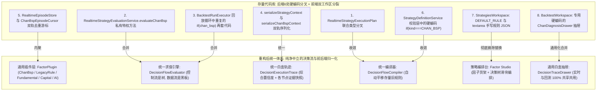

# Implementation Plan: 通用因子插件体系与决策流树架构（含存量分叉合并与前后端彻底清洗）

## 一、 实施总览与核心防线

### 1. 核心目标
1. 将现有“单一规则 1:1 直连产出信号”平滑重构为“**通用因子插件 + 决策树流式求值 + 共享黑板特征传递 + 全链路白盒归因**”系统；
2. **彻底解决存量后端技术债务**：系统性整理与合并散落在 `apps/signal`、`apps/backtest`、`apps/mist` 中的 6 大硬编码 `if (kind === 'chan_bsp')` 分叉资产，实现实时与回测求值链路 100% 统一收敛；
3. **前端老代码彻底摘除与双工作区同构（Clean-Cut Modernization）**：
   - 彻底废除策略页面手写 JSON 文本框编辑器；
   - 彻底摘除回测工作区专用的 `ChanDiagnosisDrawer` 缠论抽屉，升级为**实时与回测 100% 共享共用的 `DecisionTraceDrawer` 通用白盒归因抽屉**；
   - 消除页面级功能重复（策略页面不再内嵌多余的简易回测，回测统一由 `/backtests` 承载）；
4. **渐进式兼容（Zero Breaking Change）**：后端对存量数据库数据提供自动适配器平移，不破坏历史数据与运行稳定性。

### 2. 四大工程防线 (Engineering Principles)
1. **零代码硬编码（Zero Domain Hardcoding）**：核心调度代码不得出现任何缠论或特定指标的专有字段，缠论降级为纯外部插件套件；
2. **存量分叉零容忍（Complete Consolidation）**：坚决消除实时与回测中重复写了两套的求值分支，收敛为单一通用的 `DecisionFlowEvaluator`；
3. **前端旧袱包零保留（Zero Legacy Dead-Weight）**：彻底剔除前端手写 JSON 文本框、专用缠论抽屉、硬编码字段 catalog 等旧逻辑，换用现代化的白盒树状组件；
4. **双轨 Parity 对账保护**：重构完成后，通过双轨回放确保相同历史切片下，新旧引擎输出的信号时序与判决 100% 逐字对齐。

---

## 二、 整理合并前后的架构拓扑映射



---

## 三、 重写后的四阶段实施路线图

```mermaid
flowchart TD
    subgraph Phase1 [Phase 1: 插件契约与存量特权剥离]
        P1_1[1.1 通用类型契约 factor.types.ts] --> P1_2[1.2 插件注册表 FactorPluginRegistry]
        P1_2 --> P1_3[1.3 【存量合并】剥离缠论特权: 封装 ChanBspFactorPlugin]
        P1_2 --> P1_4[1.4 【存量合并】封装旧规则: LegacyRuleDslPlugin]
        P1_2 --> P1_5[1.5 首发多流派示范插件: 量价/基本面/资金面]
        P1_2 --> P1_6[1.6 通用外置 HTTP/Python 代理插件]
        P1_3 & P1_4 & P1_5 & P1_6 --> P1_Test[1.7 插件层单元测试与独立幂等断言]
    end

    subgraph Phase2 [Phase 2: 决策流引擎核心与快照收敛]
        P2_1[2.1 决策树 AST 与类型守卫规范] --> P2_2[2.2 共享黑板生命周期管理]
        P2_2 --> P2_3[2.3 通用递归求值器 DecisionFlowEvaluator]
        P2_3 --> P2_4[2.4 【存量合并】统一白盒轨迹构建器 TraceBuilder]
        P2_3 --> P2_5[2.5 存量策略无缝平移编译器 LegacyCompiler]
        P2_4 & P2_5 --> P2_Test[2.6 决策流引擎完整测试套件]
    end

    subgraph Phase3 [Phase 3: 实时与回测双轨链路彻底合并 (三明治架构)]
        P3_1[3.1 Migration 024 增列置信度与轨迹] --> P3_2[3.2 更新 TypeORM Signal 实体]
        P3_2 --> P3_3[3.3 【存量合并】改造 RealtimeEvaluationService 删除分叉]
        P3_2 --> P3_4[3.4 【存量合并】改造 BacktestRunExecutor 删除重复分支]
        P3_2 --> P3_5[3.5 【存量合并】解耦 StrategyDefinitionService 校验层]
        P3_3 & P3_4 & P3_5 --> P3_6[3.6 修复 security 关联消灭数字ID]
        P3_6 --> P3_7[3.7 告警通知富文本增强]
        P3_7 --> P3_8[3.8 因子货架 API 端点]
        P3_8 --> P3_Test[3.9 实时推流与离线回测双轨 Parity 对账测试]
    end

    subgraph Phase4 [Phase 4: 前端彻底清洗、双工作区归一与通用白盒抽屉]
        P4_1[4.1 【彻底摘除】清除 StrategiesWorkspace 旧手写JSON与冗余回测Tab] --> P4_2[4.2 清洗升级 mist-fe API Client 统一信号契约]
        P4_2 --> P4_3[4.3 全新组件: 因子插件货架 PluginCatalog]
        P4_3 --> P4_4[4.4 全新组件: 决策树与加权滑块编排台 DecisionFlowBuilder]
        P4_4 --> P4_5[4.5 【通用合并】开发 DecisionTraceDrawer, 彻底废除 ChanDiagnosisDrawer]
        P4_5 --> P4_6[4.6 回测工作区对齐: 升级 BacktestSignalTable 支持置信度与新抽屉]
        P4_6 --> P4_7[4.7 跨工作区 /k 看盘自动聚焦定位]
        P4_7 --> P4_Test[4.8 前端全工作区端到端与页面交互回归测试]
    end

    Phase1 --> Phase2
    Phase2 --> Phase3
    Phase3 --> Phase4
```

---

## 四、 详细任务分解与精确文件定位

### Phase 1: 插件契约与存量特权剥离 (`libs/strategy`, `libs/factor`)

#### 目标
确立领域中立的插件接口标准，把侵入核心调度层的缠论特权与存量规则 DSL 彻底剥离并封装为独立自治的插件实现。

#### 详细任务
1. **Task 1.1：核心接口契约定义**
   - **新增文件**：`libs/strategy/src/factor/factor.types.ts`
   - **契约定义**：`FactorCategory`（7 大分类枚举）、`FactorAction` (`BUY`/`SELL`/`NEUTRAL`)、`FactorOpinion`、`FactorContext`、`FactorPlugin`。
   - **验收标准**：类型定义完全中立，无任何缠论专有字段，TypeScript 编译零警告。

2. **Task 1.2：通用插件注册表**
   - **新增文件**：`libs/strategy/src/factor/factor-plugin-registry.ts`
   - **核心职责**：实现 `FactorPluginRegistry` 单例，支持按 `pluginId` 索引、按领域分类查询与单例工厂维护。
   - **验收标准**：支持动态注销/注册，查询不存在的插件返回 `undefined`，非法重复注册抛出明确异常。

3. **Task 1.3：【核心存量合并】剥离缠论特权，封装 `ChanBspFactorPlugin`**
   - **新增文件**：`libs/strategy/src/factor/plugins/chan-bsp.plugin.ts`
   - **重构要点**：
     - 将 `chanBspDetector.evaluate(projected, plan)` 搬移至插件内部；
     - 将 `ChanBspEpisodeCursor.advance` 游标前进逻辑内聚在插件内部生命周期中；
     - 插件输出严格遵循 `FactorOpinion`（`action`, `confidence: 0.85~0.95`, `reason: "5m完成底背驰且一买确立"`, `evidence: { zd, zg, divergence }`）。
   - **验收标准**：外部调度器不再直接引用 `ChanBspDetector` 与 `ChanBspEpisodeCursor`。

4. **Task 1.4：【核心存量合并】封装存量规则 DSL，实现 `LegacyRuleDslPlugin`**
   - **新增文件**：`libs/strategy/src/factor/plugins/legacy-rule-dsl.plugin.ts`
   - **重构要点**：
     - 将现存 `evaluateStrategyPlan(plan, projected, analysis)` 逻辑包装为一个标准插件；
     - 存量规则匹配命中时输出 `{ action: 'BUY', confidence: 1.0, reason: '旧版规则条件全量匹配' }`，未匹配时输出 `{ action: 'NEUTRAL', confidence: 0.0 }`。
   - **验收标准**：旧版规则 DSL 能够像普通插件一样被挂载求值，输出完全对齐。

5. **Task 1.5：扩展多流派示范插件库**
   - **新增文件**：
     - `libs/strategy/src/factor/plugins/volume-breakout.plugin.ts`（量价类：放量突破）
     - `libs/strategy/src/factor/plugins/financial-guard.plugin.ts`（基本面类：连续3年ROE避雷门禁）
     - `libs/strategy/src/factor/plugins/northbound-capital.plugin.ts`（资金面类：外资净加仓异动）
   - **验收标准**：示范插件具备良好的输入参数验证与单元测试覆盖。

6. **Task 1.6：通用外置 HTTP / Python 模型代理插件**
   - **新增文件**：`libs/strategy/src/factor/plugins/http-proxy-factor.plugin.ts`
   - **重构要点**：提供向外置 FastAPI / AI 服务发起 `POST` 异步请求的标准包装；内置 200ms 硬超时与自动降级为 `NEUTRAL` 弃权票的安全熔断机制。
   - **验收标准**：网络异常或超时时不抛出未捕获异常，安全弃权。

7. **Task 1.7：插件层单元测试与独立幂等断言**
   - **新增文件**：`libs/strategy/src/factor/factor-plugin.spec.ts`
   - **验收门禁**：测试覆盖率 100%，验证纯函数无状态幂等性。

---

### Phase 2: 决策流引擎核心与快照收敛 (`libs/strategy/decision-flow`)

#### 目标
构建基于决策树与共享黑板的流式求值器，将分叉的两套快照序列化器彻底合并为统一的白盒执行轨迹。

#### 详细任务
1. **Task 2.1：决策流树 AST 与类型守卫规范**
   - **新增文件**：`libs/strategy/src/decision-flow/decision-flow.types.ts`
   - **模型定义**：`GuardNode`, `BranchNode`, `ExtractorNode`, `ConsensusNode`, `TerminalNode` 及其联合类型。
   - **验收标准**：结构清晰支持树状嵌套，类型守卫严密。

2. **Task 2.2：共享黑板（BlackBoard Context）生命周期管理**
   - **新增文件**：`libs/strategy/src/decision-flow/flow-blackboard.ts`
   - **设计要点**：提供单次求值会话的隔离键值容器，上游特征节点写入派生特征（如 `chan.central`），下游节点按需读取。
   - **验收标准**：单次求值结束后自动释放引用，无跨 Bar 污染，杜绝内存泄漏。

3. **Task 2.3：决策流递归求值器实现 (`DecisionFlowEvaluator`)**
   - **新增文件**：`libs/strategy/src/decision-flow/decision-flow-evaluator.ts`
   - **核心算法**：
     - `GuardNode` 失败立即剪枝 Abort（毫秒级短路）；
     - `BranchNode` 动态分流；
     - `ExtractorNode` 写入黑板并前进；
     - `ConsensusNode` 并行执行局部插件加权打分，并检查 `isVeto` 一票否决权；
     - `TerminalNode` 产出最终决断与置信度。
   - **验收标准**：未命中的子树节点绝对不被触发执行。

4. **Task 2.4：【核心存量合并】统一白盒执行轨迹构建器，淘汰双轨快照**
   - **新增文件**：`libs/strategy/src/decision-flow/decision-trace-builder.ts`
   - **重构要点**：
     - 统一构建包含 `confidence`, `confidenceLevel`, `decisionPath` 的标准轨迹；
     - 两套旧快照生成器退化为对应插件输出的 `evidence` 局部快照，挂载在对应节点名下。
   - **验收标准**：任何流派的信号均输出格式统一的归因 JSON。

5. **Task 2.5：存量策略透明编译器 (`LegacyStrategyCompiler`)**
   - **新增文件**：`libs/strategy/src/decision-flow/legacy-strategy-compiler.ts`
   - **重构要点**：
     - 存量规则 DSL 自动编译为：`GuardNode(LegacyRuleDslPlugin) -> TerminalNode(BUY)`；
     - 存量缠论策略自动编译为：`GuardNode(ChanBspFactorPlugin) -> TerminalNode(BUY)`。
   - **验收标准**：存量策略零感知平移进决策流引擎。

6. **Task 2.6：决策流引擎完整测试套件**
   - **新增文件**：`libs/strategy/src/decision-flow/decision-flow-evaluator.spec.ts`
   - **验收门禁**：通过复合决策树求值测试（短路剪枝、分支分流、一票否决、加权共识计算）。

---

### Phase 3: 实时与回测双轨链路彻底合并 (三明治架构薄壳化)

#### 目标
将现存在 `RealtimeStrategyEvaluationService` 与 `BacktestRunExecutor` 中的硬编码 `if (kind === 'chan_bsp')` 全面剔除，两者均收敛为只负责输入与输出的“薄壳消费者”。

#### 详细任务
1. **Task 3.1：数据库 Migration 024 落地**
   - **新增文件**：`deploy/database/migrations/024_add_signal_confidence_and_trace.sql`
   - **SQL 变动**：在 `strategy_signals` 与 `backtest_signal_results` 表中增加 `confidence` (DECIMAL 5,2), `confidence_level` (ENUM), `decision_trace` (JSON) 列；扩充 `strategy_definitions.kind` 与 `backtest_runs.kind` 支持 `'decision_flow'`。
   - **验收标准**：Forward-only 迁移执行成功，存量字段赋予合理默认值。

2. **Task 3.2：更新 TypeORM Signal 实体定义**
   - **修改文件**：`libs/shared-data/src/entities/strategy-signal.entity.ts`
   - **重构要点**：增加新列字段映射与只读类型。
   - **验收标准**：实体读写正常，单元测试通过。

3. **Task 3.3：【核心存量合并】改造 `RealtimeStrategyEvaluationService`，删除特权分支**
   - **修改文件**：`libs/signal/src/runtime/realtime-strategy-evaluation.service.ts`
   - **核心收敛动作**：
     - **彻底删除私有方法 `evaluateChanBsp`**；
     - **彻底删除类型联合分叉 `RealtimeStrategyExecutionPlan`**，收敛为统一持有 `DecisionFlowNode`；
     - 核心循环纯粹调用 `DecisionFlowEvaluator.evaluate(execution.rootNode, context)`。
   - **验收标准**：实时求值服务中再无任何 `chan_bsp` 或特定指标的硬编码字样。

4. **Task 3.4：【核心存量合并】改造 `BacktestRunExecutor`，消除重复回放分支**
   - **修改文件**：`apps/backtest/src/backtest-run.executor.ts`
   - **核心收敛动作**：
     - **彻底删除第 351-410 行中重复写的两套 `if (plan.kind === 'chan_bsp') { ... } else { ... }` 逻辑**；
     - 回测执行器仅负责推进滑动窗口 `imputer.append(bar)`，然后统一调用 `this.flowEvaluator.evaluate(rootNode, context)`；
     - 信号持久化统一使用 `outcome.trace`。
   - **验收标准**：回测回放循环代码缩减 50% 以上，实盘与回测 100% 共享求值内核。

5. **Task 3.5：【核心存量合并】解耦 `StrategyDefinitionService` 校验与编译层**
   - **修改文件**：`apps/mist/src/strategy/services/strategy-definition.service.ts`
   - **核心收敛动作**：
     - 消除 `validateStoredVersion` 与 `validateRuleForCreate` 内部硬编码的 `if (definition.kind === StrategyKind.CHAN_BSP)` 分支；
     - 统一交由 `DecisionFlowCompiler` 校验决策树拓扑。
   - **验收标准**：策略创建和启用服务彻底与具体插件种类解耦。

6. **Task 3.6：【修复数据缺陷】`StrategySignalService` 补全 `security` 实体关联**
   - **修改文件**：`apps/mist/src/strategy/services/strategy-signal.service.ts`
   - **重构要点**：
     - 在 `signalRepository.find` 查询中显式增加 `relations: ['security']`；
     - 组装响应时填充 `securityCode` 与 `securityName`，**彻底终结前端实时信号只显示 `securityId: 142` 数字代码的缺陷**。
   - **验收标准**：实时信号接口返回包含真实股票代码与名称，单元测试通过。

7. **Task 3.7：告警通知层置信度与决策摘要增强 (`apps/notification`)**
   - **修改文件**：`apps/notification/src/delivery/notification-envelope.ts`
   - **重构要点**：
     - 移除旧 `CHAN_BSP_TYPE_NAMES` 专有映射；
     - 格式化文本纳入置信度与白盒理由：`[Mist] 000001 平安银行 做多 @ 12.50 [置信度: 86.5% S级] | 理由: 大盘安全 -> 财务避雷 -> 突破共振 | 策略名 | 5m | 时间`。
   - **验收标准**：微信/飞书端接收到包含置信度与一句话摘要的富文本通知。

8. **Task 3.8：因子货架元数据 API 端点 (`apps/mist`)**
   - **修改文件**：`apps/mist/src/strategy/controllers/strategy.controller.ts`
   - **新增端点**：`GET /v1/factors/plugins`，从 `FactorPluginRegistry` 动态读取元数据返回前端。
   - **验收标准**：接口输出已注册的插件列表，包含分类、版本及参数 Schema。

9. **Task 3.9：双轨 Parity 对账测试**
   - **新增文件**：`apps/signal/test/decision-flow-realtime-parity.spec.ts`
   - **验收门禁**：在相同历史切片下，离线回测与实时推流输出的信号时序、置信度与决策轨迹逐字对齐。

---

### Phase 4: 前端老代码彻底摘除、双工作区同构与通用白盒抽屉 (`mist-fe`)

#### 目标
**坚决不留旧包袱**：
- 策略页面彻底删除旧手写 JSON 文本框，消除重复的简易回测 Tab；
- 回测工作区彻底废除专用缠论抽屉 `ChanDiagnosisDrawer`，实时与回测 **100% 共享通用的 `DecisionTraceDrawer` 白盒归因抽屉**；
- 打通实时信号、回测信号与 `/k` K 线看盘的无缝联动。

#### 详细任务
1. **Task 4.1：【前端彻底摘除】清除 `StrategiesWorkspace` 旧手写文本框与多余 Tab**
   - **修改文件**：`mist-fe/app/strategies/StrategiesWorkspace.tsx`
   - **摘除清单**：
     - 彻底删除 `DEFAULT_RULE = { field: "k.volume", operator: "gt", value: "100" }`；
     - 彻底删除 `ruleText` 状态及 `<textarea value={ruleText}>` 手写 JSON 编辑器；
     - 彻底删除 `activeTab === "backtests"` 的内部嵌入回测 Tab（回测功能统一收拢在 `/backtests` 页面）。
   - **验收标准**：界面不再有任何生硬的手写 JSON 文本框，页面结构清晰。

2. **Task 4.2：清洗升级 `mist-fe` API Client 统一信号契约**
   - **修改文件**：`mist-fe/app/api/client.ts`
   - **重构要点**：
     - 扩展并归一化 `StrategySignal` 与 `StrategyBacktestSignalResult`，统一输出 `UnifiedSignalVo`（含 `confidence: number`, `confidenceLevel`, `decisionTrace`）；
     - 新增 `fetchFactorPlugins()` 与 `saveDecisionFlowStrategy()` 接口客户端；
     - 移除旧版单规则专有入参。
   - **验收标准**：严格通过 `parseEnvelope` 契约校验，编译零错误。

3. **Task 4.3：全新组件：因子插件货架 (`PluginCatalog.tsx`)**
   - **新增文件**：`mist-fe/app/components/decision/PluginCatalog.tsx`
   - **功能**：卡片网格形式直观展示平台 7 大领域已安装的因子插件，展示所属分类 Tag、版本及参数说明。
   - **验收标准**：响应式布局良好，支持分类筛选和快速检索。

4. **Task 4.4：全新组件：决策流树编排台 (`DecisionFlowBuilder.tsx`)**
   - **新增文件**：`mist-fe/app/components/decision/DecisionFlowBuilder.tsx`
   - **功能**：
     - 树状层级可视化配置：门禁节点 (Guard)、分支路由 (Branch)；
     - 局部加权共识配置器：多选因子插件，拖拽**权重滑块 (Weight Slider: 40%, 35%, 25%)**，配置**触发阈值 (Threshold: 75.0)** 与**一票否决开关 (Veto)**。
   - **验收标准**：所见即所得，自动校验权重和为 100，生成规范合法的 DSL。

5. **Task 4.5：【通用合并】全新组件：通用白盒归因抽屉 (`DecisionTraceDrawer.tsx`)**
   - **新增文件**：`mist-fe/app/components/decision/DecisionTraceDrawer.tsx`
   - **废弃并删除**：`mist-fe/app/backtests/components/ChanDiagnosisDrawer.tsx`
   - **重构要点**：
     - **实时与回测 100% 共享共用同一个抽屉**；
     - 抽屉展示：综合置信度得分、置信评级、从根节点到叶子节点的命中时间轴（Timeline）；
     - **动态插件证据卡片**：如果策略含缠论插件，展示 ZG/ZD/GG/DD 与背驰；如果含财务插件，展示 ROE 卡片；如果衡量量价，展示量比卡片。
   - **验收标准**：无论是实时买点还是回测买点，点击均能弹出统一的白盒时间轴归因。

6. **Task 4.6：回测工作区组件对齐与升级**
   - **修改文件**：
     - `mist-fe/app/backtests/components/BacktestSignalTable.tsx`
     - `mist-fe/app/backtests/BacktestWorkspace.tsx`
   - **重构要点**：
     - 删除 `BacktestSignalTable` 中硬编码的 `BSP_LABEL_MAP` 与 `1bsp/2bsp/3bsp` 过滤按钮；
     - 表格增加彩色置信度 Badge，支持按置信度筛选；
     - 点击信号行调用共享的 `DecisionTraceDrawer`；
     - 更新 K 线 Marker 标记为带置信度的文字（如 `买 88%` / `卖 92%`）。
   - **验收标准**：回测页面无缝支持任何多流派策略的信号展示与深度归因。

7. **Task 4.7：跨工作区无缝看盘联动**
   - **修改文件**：`mist-fe/app/k/KLineLivePage.tsx`
   - **功能**：在实时信号与回测信号表格中新增“在看盘中打开”，跳转至 `/k?code=...&period=...&focusTime=...`，自动滚动聚焦该时刻 K 线柱体并标记信号。

8. **Task 4.8：前端全工作区端到端与交互回归测试**
   - **修改文件**：`mist-fe/app/strategies/__tests__/`, `mist-fe/app/backtests/__tests__/`
   - **验收门禁**：通过现有测试，新组件交互与渲染测试 100% 通过。

---

## 五、 实施全过程风险控制与应急回滚策略

1. **后端存量数据平移**：存量数据库中的旧策略无需人工重配，通过 `LegacyStrategyCompiler` 自动映射为单节点树执行；
2. **前端彻底替换安全**：新组件拆分为独立的清晰子模块，通过 `WorkspaceShell` 统一挂载，先跑通单元测试再替换页面根入口；
3. **外置 HTTP 插件超时隔离**：必须设置 200ms 硬超时，网络断开或超时安全降级为 `NEUTRAL` 弃权票，禁止阻断主推流任务。

---

## 六、 编制确认

本实施计划已全量重写并涵盖前端老代码彻底摘除与回测/实时抽屉同构方案。严格遵循你的指示，**本轮未改动任何业务源码**。
待你审阅确认后，我们即可随时从 **Phase 1 的任务 1.1（核心类型契约 `factor.types.ts`）** 启动代码落地。
