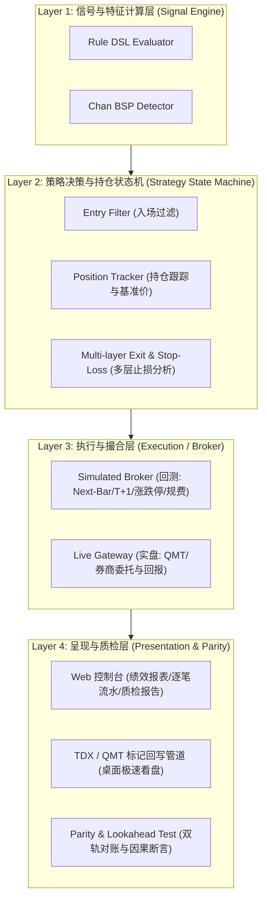
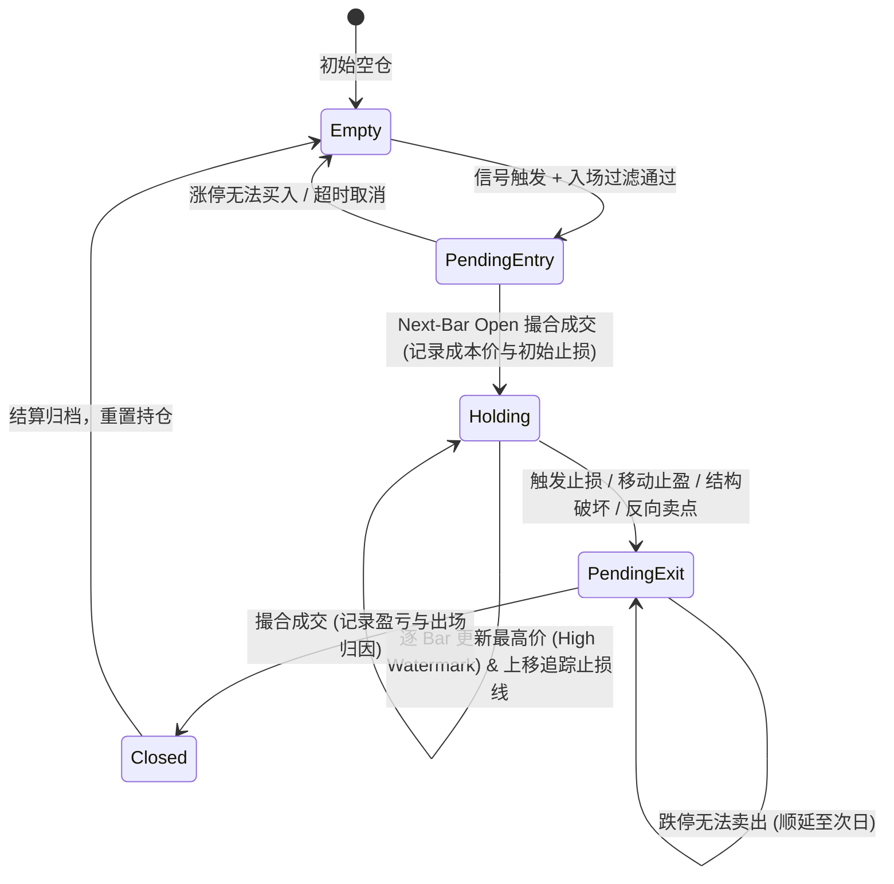
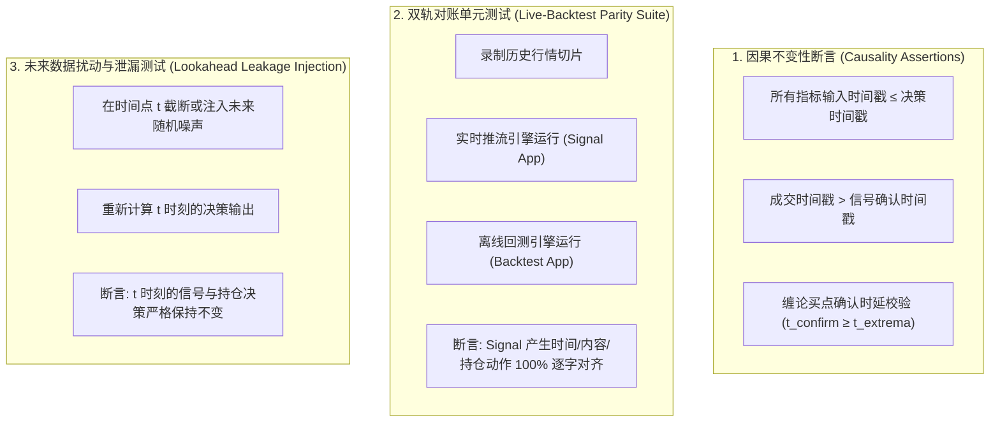

# Design: 量化回测决策状态机、严格 A 股撮合与防未来函数质检体系

## 1. 架构总览



---

## 2. 策略决策与持仓生命周期状态机（Strategy State Machine）

### 2.1 状态转移图



### 2.2 出场与止损规则配置契约（`StrategyExitPolicy`）

```typescript
export interface StrategyExitPolicy {
  // 1. 缠论结构止损
  chanStructuralStop?: {
    enabled: boolean;
    reference: 'point_price' | 'zhongshu_zd' | 'zhongshu_dd'; // 跌破买点笔底 / 中枢下轨 / 最低点
    bufferRatio?: number; // 缓冲比例，如 0.005 (0.5%)
  };
  // 2. 动态保本机制
  breakEven?: {
    enabled: boolean;
    triggerProfitRatio: number; // 浮盈达到此比例 (如 0.03 = 3%) 后上移止损线至成本价
  };
  // 3. 移动追踪止盈
  trailingStop?: {
    enabled: boolean;
    activationProfitRatio: number; // 激活阈值 (如浮盈达到 5%)
    callbackRatio: number; // 从最高点回撤比例 (如 2%) 触发平仓
  };
  // 4. 硬风控止损
  hardStopLossRatio?: number; // 固定止损比例，如 0.05 (5%)
  // 5. 反向卖点出场
  oppositeSignalExit?: boolean; // 出现反向一卖/二卖/三卖或顶分型确立出场
  // 6. 最大持仓 K 线数超时出场
  maxHoldingBars?: number; // 超过 N 根 Bar 未触发止盈止损强制平仓
}
```

---

## 3. A 股严格成交撮合模型（Lookahead-Free Simulated Broker）

### 3.1 时序与撮合规则

| 动作 | 判定时机 | 撮合时机与价格 | 异常与边界处理 |
| :--- | :--- | :--- | :--- |
| **开仓买入** | Bar $t$ 闭合计算确认信号 | Bar $t+1$ 以 `open` 价格撮合 | 若 Bar $t+1$ 涨停一字板（`open == highLimit`），标记 `BUY_REJECTED_LIMIT_UP`，撤单放弃 |
| **盘中触价止损** | Bar $t$ 处于持仓状态且已过 T+1 | 若 `bar.low <= stopPrice`：<br>• 若 `open <= stopPrice`，以 `open` 成交；<br>• 否则以 `stopPrice` 撮合 | 若 Bar $t$ 跌停一字板（`open == lowLimit`），标记 `SELL_BLOCKED_LIMIT_DOWN`，顺延至次日 |
| **收盘信号/形态卖出** | Bar $t$ 闭合计算满足出场条件 | Bar $t+1$ 以 `open` 价格撮合 | 严格受 T+1 限制（当天买入的标的当天不可卖出，持仓锁定至次日） |

### 3.2 摩擦成本与滑点模型

- **佣金 (Commission)**: `max(5.0, tradeAmount * 0.00025)` (买卖双向)
- **印花税 (Stamp Duty)**: `tradeAmount * 0.0005` (仅卖出单向)
- **过户费 (Transfer Fee)**: `tradeAmount * 0.00001` (买卖双向)
- **滑点 (Slippage)**: 默认 0.1% 或固定 1~2 Tick，买入上浮、卖出下浮。

---

## 4. 三维防未来函数质检与对账机制



---

## 5. 实体与数据库设计（Schema Migrations）

### 5.1 `backtest_trade_results` 表（替代/升级现有仅信号表）

```sql
CREATE TABLE `backtest_trade_results` (
  `id` INT AUTO_INCREMENT PRIMARY KEY,
  `backtest_run_id` INT NOT NULL,
  `security_code` VARCHAR(20) NOT NULL,
  `entry_signal_time` DATETIME(3) NOT NULL,
  `entry_time` DATETIME(3) NOT NULL,
  `entry_price` DECIMAL(12, 4) NOT NULL,
  `exit_signal_time` DATETIME(3) NOT NULL,
  `exit_time` DATETIME(3) NOT NULL,
  `exit_price` DECIMAL(12, 4) NOT NULL,
  `exit_reason` VARCHAR(60) NOT NULL, -- 'STRUCTURAL_CHAN_STOP' | 'TRAILING_STOP' | 'BREAK_EVEN' | 'HARD_STOP_LOSS' | 'OPPOSITE_SIGNAL' | 'TIMEOUT'
  `holding_bars` INT NOT NULL,
  `pnl_amount` DECIMAL(14, 4) NOT NULL,
  `pnl_ratio` DECIMAL(8, 4) NOT NULL,
  `total_fee` DECIMAL(10, 4) NOT NULL,
  `context_snapshot` JSON NOT NULL,
  `created_at` DATETIME(3) DEFAULT CURRENT_TIMESTAMP(3),
  INDEX `idx_run_id` (`backtest_run_id`),
  INDEX `idx_security` (`security_code`)
) ENGINE=InnoDB DEFAULT CHARSET=utf8mb4;
```

---

## 6. 与原生终端可视化（QMT / TDX）与 Web 控制台分工

1. **Web 端 (`mist-fe`)**：
   - 任务控制与状态轮询；
   - 量化绩效卡片：总收益率、年化收益率、夏普比率、最大回撤、胜率、盈亏比、交易总次数；
   - 逐笔 Trade 流水表格（包含入场时间/价格、出场时间/价格、持仓时长、出场归因）；
   - 因果质检报告（时序断言与双轨对账状态）。
2. **桌面端 (`TDX / QMT`)**：
   - 通过 `openspec/changes/integrate-native-terminal-visualization` 提供的绘图指令接口，将回测生成的 Trade 序列自动转为买入 Pin 标、卖出 Pin 标、持仓连接线与动态止损警戒线，在桌面专业终端极速复盘。
