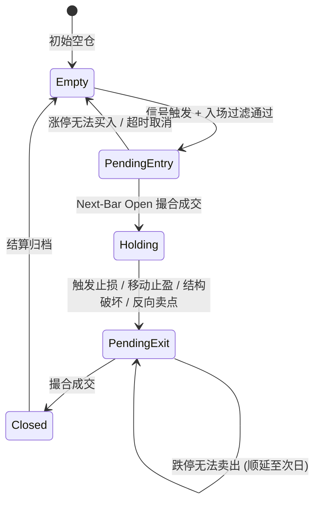

# OpenSpec: 回测决策状态机与防未来函数质检系统 (backtest-trade-decision)

## 1. 概述

本规范定义了 Mist 量化交易系统中，从“点状指标信号计算”演进为“统一策略决策与持仓生命周期状态机”，并引入严格 A 股成交规则与三维防未来函数质检体系的核心契约与行为规范。

---

## 2. 需求与行为规范（Requirements & Scenarios）

### 2.1 策略状态机迁移规范

**Requirement: Position State Machine Transitions**
系统必须维护严格的持仓状态机，回测与实时环境必须共享同一套状态机实现。

- **Scenario: 初始状态**
  - Given 策略初始化或无持仓
  - Then 状态为 `Empty`，持仓量为 0，止损基准价为 null。

- **Scenario: 买入信号触发入场**
  - Given 状态为 `Empty` 且收到买入信号（如缠论一买/二买/三买 或 DSL Entry 满足）
  - When 入场过滤检查通过（未达到持仓上限、非停牌）
  - Then 状态转移为 `PendingEntry`，记录触发时的 `entrySignalTime` 与推荐止损价。

- **Scenario: 次根 Bar 开盘撮合成交**
  - Given 状态为 `PendingEntry`
  - When 到达下一根 Bar $t+1$
  - Then 若非一字涨停，以 Bar $t+1$ 的 `open` 价（考虑滑点与手续费）撮合成交，状态转移为 `Holding`，记录 `costPrice = openPrice`，`highWatermark = openPrice`。

---

### 2.2 多层组合出场与止损规则规范

**Requirement: Multi-Layer Exit & Stop-Loss Policy Evaluation**
持仓状态下，系统必须逐 Bar 评估多层出场规则，并按优先级严格裁决。

- **Scenario: 缠论结构破坏止损**
  - Given 策略配置了 `chanStructuralStop`，状态为 `Holding` 且已满足 T+1 交易制度
  - When 价格跌破买点依托的笔底/分型底 或 跌破中枢下轨 `zd`（`low <= stopLossPrice`）
  - Then 状态转移为 `PendingExit`，以触发价或当前 Bar 开盘价撮合止损，`exitReason` 记录为 `STRUCTURAL_CHAN_STOP`。

- **Scenario: 动态保本机制生效**
  - Given 策略配置了 `breakEven`（例如阈值为浮盈 $+3\%$）
  - When 价格最高点达到 `costPrice * 1.03`
  - Then 系统的动态止损价自动上移至 `costPrice * (1 + feeRatio)`，后续若价格回落不再发生亏损。

- **Scenario: 移动追踪止盈生效**
  - Given 策略配置了 `trailingStop`（激活阈值 $+5\%$，回撤比例 $2\%$）
  - When 持仓浮盈曾突破 $+5\%$，且随后价格从持仓期间历史最高价 `highWatermark` 回撤达到 $2\%$
  - Then 状态转移为 `PendingExit`，触发平仓，`exitReason` 记录为 `TRAILING_STOP`。

- **Scenario: 硬止损兜底**
  - Given 策略配置了 `hardStopLossRatio`（如 $5\%$）
  - When 价格跌破 `costPrice * 0.95`
  - Then 无论任何形态或指标，立即触发斩仓出场，`exitReason` 记录为 `HARD_STOP_LOSS`。

---

### 2.3 A 股真实交易约束规范

**Requirement: A-Share Trading Frictions & Constraints**
回测执行器必须严格模拟 A 股制度摩擦，杜绝理想化虚假成交。

- **Scenario: T+1 交易锁定制**
  - Given 股票在 $t$ 日日内买入成交（状态为 `Holding`）
  - When 在 $t$ 日后续分钟内触发任何卖出或止损信号
  - Then 禁止在 $t$ 日内卖出，平仓动作必须锁定并顺延至 $t+1$ 交易日开盘方可撮合。

- **Scenario: 涨停板买入拦截**
  - Given 状态为 `PendingEntry`
  - When Bar $t+1$ 开盘价等于涨停板价格（`open == highLimit`）且全天未开板
  - Then 判定为一字涨停无法买入，订单取消并记录 `BUY_REJECTED_LIMIT_UP`，状态回退为 `Empty`。

- **Scenario: 跌停板卖出顺延**
  - Given 状态为 `PendingExit` 且已过 T+1 锁定期
  - When Bar 开盘价等于跌停板价格（`open == lowLimit`）且全天无法卖出
  - Then 标记 `SELL_BLOCKED_LIMIT_DOWN`，保持持仓并顺延至下一个能够正常成交的交易日撮合。

---

### 2.4 三维防未来函数质检规范

**Requirement: Lookahead-Free Verification & Parity Invariants**
系统必须具备自动化的防未来函数检验与双轨一致性对账能力。

- **Scenario: 因果不变性断言**
  - Given 回测运行中在时刻 $t$ 进行任何计算
  - Then 传入的所有 K 线、指标及结构时间戳必须 $\le t$；任何产生的 Trade 成交时间戳必须 $> t$。

- **Scenario: 实时推流与离线回测双轨 Parity 对账**
  - Given 对同一段历史行情切片，分别通过 `Signal App`（实时推流）与 `Backtest App`（离线批处理）执行相同策略
  - Then 产生的 `Signal` 序列、`Trade` 序列、入场价、出场价及出场原因必须 100% 逐字对齐。

- **Scenario: 未来数据扰动注入检验**
  - Given 在回测时间线上的时刻 $t$
  - When 对时刻 $t$ 之后的所有未来 K 线注入随机噪声或直接截断
  - Then 在时刻 $t$ 及之前产生的所有信号与持仓动作必须保持 100% 恒定不变。
