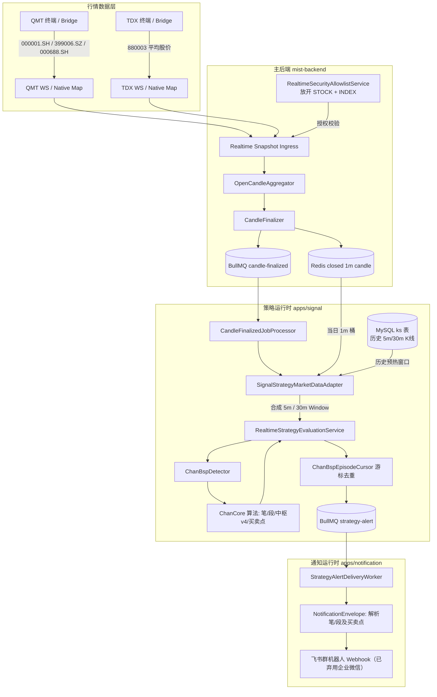

# Design: 实盘验证缠论买卖点算法（指数标的）

## 1. 架构与数据链路



## 2. 详细设计与关键决策

### 2.1 证券类型放开 (SecurityType Gate Relaxation)

- **现有约束**：
  在 `integrate-production-realtime-subscription-lifecycle` 引入时，白名单查询与期望权威查询仅包含 `security.type = SecurityType.STOCK`。
- **调整设计**：
  - `RealtimeSecurityAllowlistService.refreshAssignedFromDb`:
    使用 `security.type IN (:...types)` 查询，`types` 为 `[SecurityType.STOCK, SecurityType.INDEX]`。
  - `RealtimeSubscriptionLifecycleCoordinator.queryDesiredAuthority`:
    使用 `security.type IN (:...types)` 查询，`types` 为 `[SecurityType.STOCK, SecurityType.INDEX]`。
  - `InitializeRealtimeSubscriptionDto`:
    校验器 `@IsIn([SecurityType.STOCK, SecurityType.INDEX])`。
  - `RealtimeSubscriptionVo`:
    字段 `securityType: SecurityType`。

### 2.2 4 大指数标的与数据源映射

| 序号 | 证券代码 | 证券名称 | 类型 | 格式代码 | 数据源 | 说明 |
|---|---|---|---|---|---|---|
| 1 | `000001` | 上证指数 | `INDEX` | `000001.SH` | `QMT` | 交易所官方指数，QMT 原生全推支持 |
| 2 | `399006` | 创业板指 | `INDEX` | `399006.SZ` | `QMT` | 交易所官方指数，QMT 原生全推支持 |
| 3 | `000688` | 科创50 | `INDEX` | `000688.SH` | `QMT` | 交易所官方指数，QMT 原生全推支持 |
| 4 | `880003` | 平均股价 | `INDEX` | `880003.SH` / `880003` | `TDX` | 通达信专有板块指数，TDX 直连全推支持 |

### 2.3 策略配置与求值模型 (Chan BSP Multi-level Strategy)

每个指数分别配置 4 个独立的 `StrategyDefinition`（共 16 组策略实例）：
1. **5m 笔级**：`periods = [5]`, `rule = { units: 'bi', direction: 'both', points: { first: true, second: true, third: true } }`
2. **5m 段级**：`periods = [5]`, `rule = { units: 'duan', direction: 'both', points: { first: true, second: true, third: true } }`
3. **30m 笔级**：`periods = [30]`, `rule = { units: 'bi', direction: 'both', points: { first: true, second: true, third: true } }`
4. **30m 段级**：`periods = [30]`, `rule = { units: 'duan', direction: 'both', points: { first: true, second: true, third: true } }`

### 2.4 数据预算与历史预热 (Window Budget Pre-warming)

- `CHAN_BSP_WINDOW_BUDGET`:
  - 5m 级别要求最少 **500** 根有效 K 线（约 10.4 交易日）。
  - 30m 级别要求最少 **200** 根有效 K 线（约 25 交易日）。
- **预热动作**：
  通过 `apps/schedule` 提供的 `/v1/collector/collect` 接口，在开盘前采集过去 30 个交易日的 5m 与 30m 历史 K 线并落入 `ks` 表。

### 2.5 告警文案解析强化

- `ChanBspContextSnapshot`: 包含 `type`（如 `'first_buy'`）、`units`（`'bi' | 'duan'`）、`level`（`5 | 30`）、`price`、`zg`、`zd`。
- `buildNotificationEnvelope`:
  ```ts
  const typeMap = {
    first_buy: '一买',
    second_buy: '二买',
    third_buy: '三买',
    first_sell: '一卖',
    second_sell: '二卖',
    third_sell: '三卖',
  };
  const unitLabel = ctx.chanBsp.units === 'bi' ? '笔级' : '段级';
  const actionLabel = `${typeMap[ctx.chanBsp.type]} (${unitLabel})`;
  ```
  生成文案示例：
  `[Mist] 000001 上证指数 一买 (笔级) @ 3050.25 | 上证指数 5m 笔级缠论买卖点 | 5分钟 | 2026-08-26 10:15:00`

---

## 3. 风险排查与防范措施

1. **冷启动窗口不足**：
   - 风险：若未提前采集历史 K 线，实时求值窗口长度 < 预算，`ChanBspDetector` 默认为空，盘中无信号。
   - 措施：前置执行采集任务，并在启动健康检查中核查 `ks` 表历史条数。
2. **QMT 成交量单位转换**：
   - 风险：QMT 股票 volume 为手，指数 volume 是否同为手。
   - 措施：`Decimal8` 与 `Number.isSafeInteger` 支持到 9000 万亿，计算过程绝不溢出；缠论买卖点判定核心依赖价格分型、中枢几何与 MACD 柱面积（基于收盘价），对成交量绝对值不敏感。
3. **重复告警**：
   - 措施：`ChanBspEpisodeCursor` 记录已确认单元的 `unitIndex`，相同中枢或已确认笔不重复告警。
